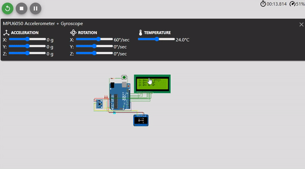

# Gyroscope

MPU sensor will detect the acceleration and rotation of the object. then, the object will be simulate and displayed in OLED. Respectively, LCD will display the object relative angle information

